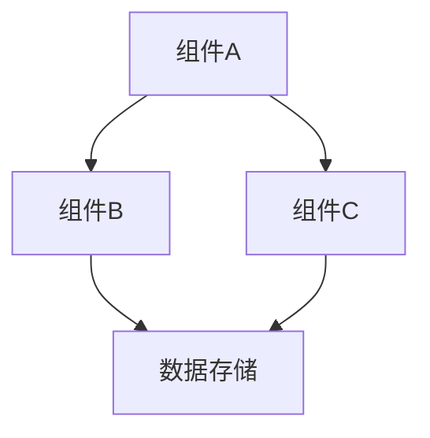

# 设计文档

## 概述

[简要描述功能的设计思路和目标]

## 架构

[描述功能的整体架构，可以使用图表]



## 组件和接口

### 组件A

**职责:** [描述组件职责]

**接口:**
```typescript
interface IComponentAProps {
  // 属性定义
}
```

### 组件B

**职责:** [描述组件职责]

**接口:**
```typescript
interface IComponentBProps {
  // 属性定义
}
```

## 数据模型

```typescript
interface INewDataModel {
  // 数据模型定义
}
```

## 错误处理

[描述错误处理策略]

## 测试策略

[描述测试策略和测试用例]